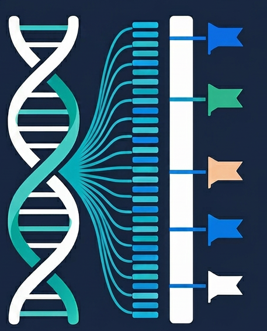

GRmap is a lightweight workflow for matching sequencing reads to a reference genome and annotating those matches with
gene, TSS, CpG, and repeat metadata.

---

## [Documentation](https://bibymaths.github.io/grmap/)

---

## [LICENSE](LICENSE)

---
